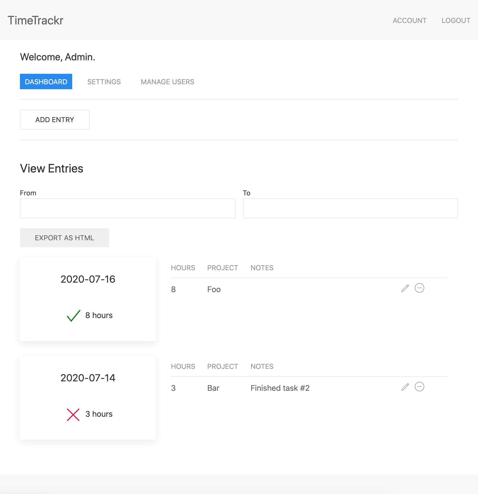

# Timetrackr

*The name was actually just a typo.*

---

## Screenshot



## Setup

Install and run MongoDB:

```sh
$ brew tap mongodb/brew
$ brew install mongodb-community
$ mongod --config /usr/local/etc/mongod.conf
```

Install NPM dependencies:

```sh
$ npm install
```

## Run app

```sh
$ npm start
$ open http://localhost:8080/
```

## Testing

```sh
$ npm test
```

To try out admin/manager features:

1. Sign up on the site
2. Use `./bin/setlevel.js`

For example:

```sh
$ ./bin/setlevel.js me@example.com admin
```

Pass no arguments for CLI help.

## Development environment

These are recommended:

* VS Code
* [Jest Runner](https://github.com/jest-community/vscode-jest) VS Code plugin
* [vscode-lit-html](https://github.com/mjbvz/vscode-lit-html) VS Code plugin

## Architectural design

- Make REST the real first-class citizen
  - All web app actions should also be available via REST
  - All REST responses should return a valid JSON object
  - All errors should be returned via root "error" key
  - All REST responses should also use semantic HTTP codes
- Avoid all build phases for super-rapid prototyping:
  - TypeScript is supported within VS Code
  - JSDoc is used to provide extra hints to TSC
  - JSX is faked via [htm](https://github.com/developit/htm) package
  - Modules use `<script type="module">` (see [JS Modules](https://developer.mozilla.org/en-US/docs/Web/JavaScript/Guide/Modules))

## Upcoming features

To start with, we're focusing on an MVP with minimal features needed to get the job done. As the user-base increases, we'll add the following features:

- [ ] Audit log of all system changes
- [ ] Pagination on all the pages
- [ ] Electron client (status-bar for Mac, taskbar for Windows)
- [ ] Change email & password
  - [ ] Users will no longer be identified by email in the system at that point
- [ ] Email verification for new accounts
